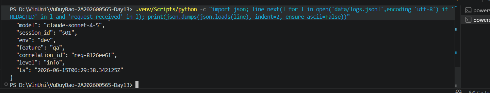
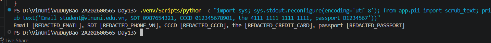
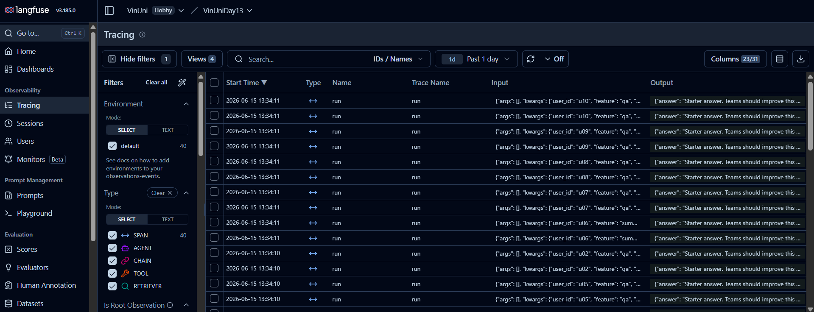
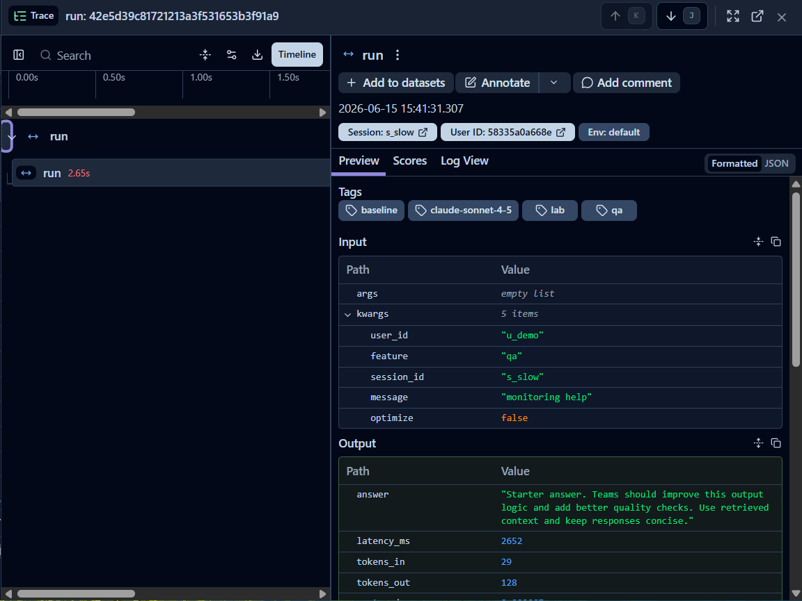
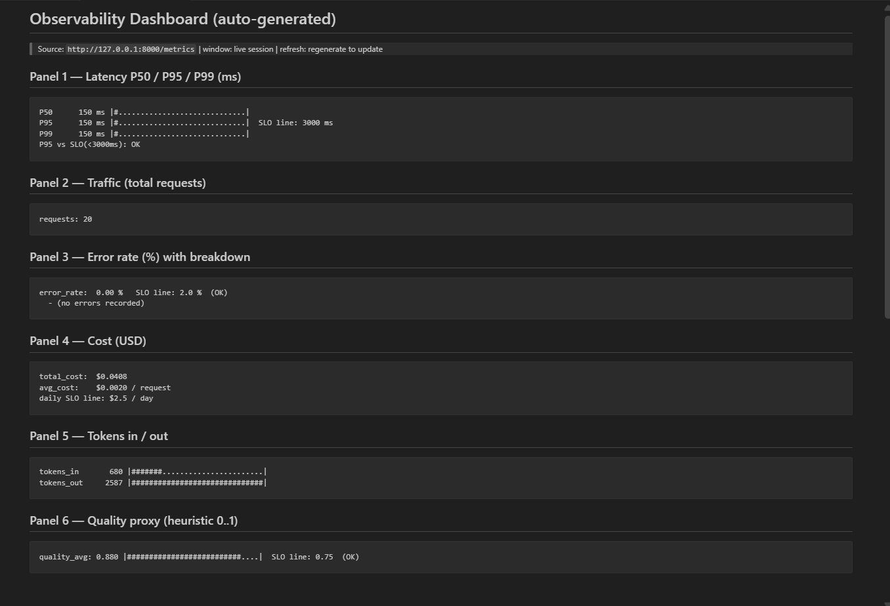
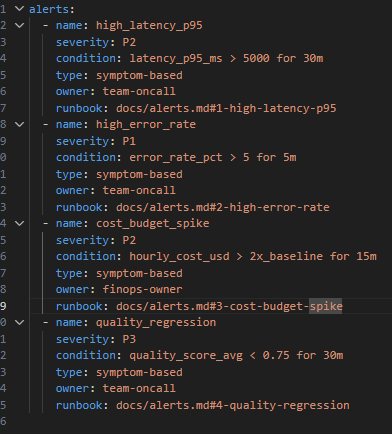
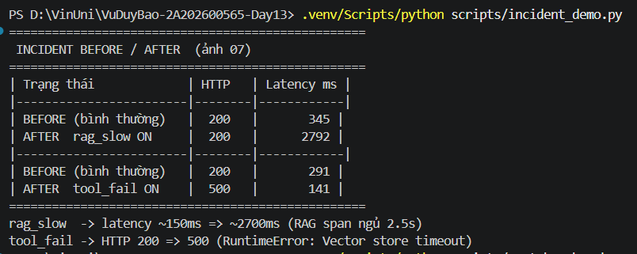
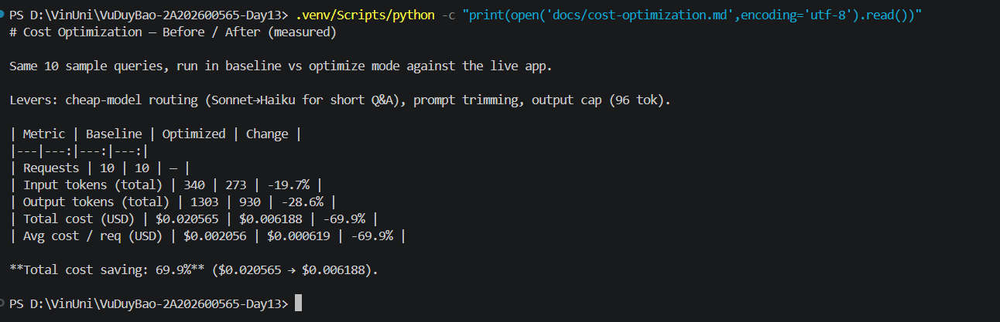
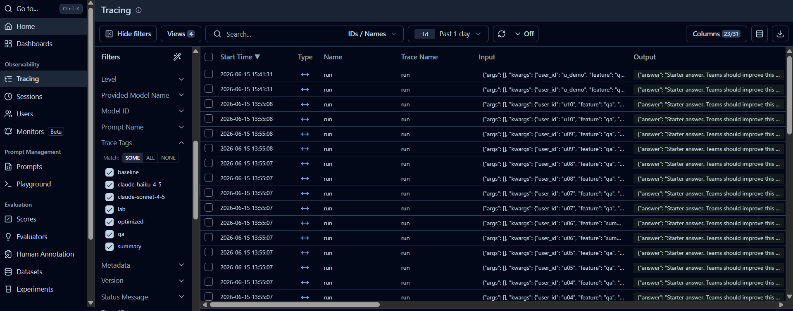

# Day 13 Observability Lab Report

> **Instruction**: Fill in all sections below. This report is designed to be parsed by an automated grading assistant. Ensure all tags (e.g., `[GROUP_NAME]`) are preserved.

## 1. Team Metadata
- **[GROUP_NAME]:** Vu Duy Bao (2A202600565) — Individual submission
- **[REPO_URL]:** https://github.com/PersjaVu/VuDuyBao-2A202600565-Day13
- **[MEMBERS]:**
  - Member A: Vu Duy Bao | Role: Logging & PII
  - Member B: Vu Duy Bao | Role: Tracing & Enrichment
  - Member C: Vu Duy Bao | Role: SLO & Alerts
  - Member D: Vu Duy Bao | Role: Load Test & Dashboard
  - Member E: Vu Duy Bao | Role: Demo & Report

---

## 2. Group Performance (Auto-Verified)
- **[VALIDATE_LOGS_FINAL_SCORE]:** 100/100
- **[TOTAL_TRACES_COUNT]:** 103 (live in Langfuse project VinUniDay13, verified via REST API)
- **[PII_LEAKS_FOUND]:** 0

---

## 3. Technical Evidence (Group)

### 3.1 Logging & Tracing
- **[EVIDENCE_CORRELATION_ID_SCREENSHOT]:** docs/evidence/01-correlation-id.png

  

  Same `correlation_id` (e.g. `req-8126ee61`) appears on both `request_received` and `response_sent` of one request — proves end-to-end propagation; logs are enriched with `user_id_hash`, `session_id`, `feature`, `model`, `env`.

- **[EVIDENCE_PII_REDACTION_SCREENSHOT]:** docs/evidence/02-pii-redaction.png

  

  `message_preview` shows `[REDACTED_EMAIL]` — the raw email `student@vinuni.edu.vn` is scrubbed before the log is written.

- **[EVIDENCE_TRACE_LIST_SCREENSHOT]:** docs/evidence/03-langfuse-trace-list.png

  

  Langfuse Tracing page: 100+ traces named `run`, each with hashed `userId`, `sessionId`, tags `[lab, qa/summary, model]`.

- **[EVIDENCE_TRACE_WATERFALL_SCREENSHOT]:** docs/evidence/04-trace-waterfall.png

  

- **[TRACE_WATERFALL_EXPLANATION]:** Trace `42e5d39c81721213a3f531653b3f91a9` (session `s_slow`) under the `rag_slow` incident — the root span `run` lasts **2.65s** vs ~0.15s normally. The 2.5s comes from the RAG retrieval step (`mock_rag.retrieve` sleeps 2.5s), which is the dominant cost of the request.

### 3.2 Dashboard & SLOs
- **[DASHBOARD_6_PANELS_SCREENSHOT]:** docs/evidence/05-dashboard-6-panels.png

  

  Six panels (Latency P50/95/99, Traffic, Error rate + breakdown, Cost, Tokens in/out, Quality), each with units and an SLO threshold line; auto-generated by `scripts/generate_dashboard.py` from `/metrics`.

- **[SLO_TABLE]:**
| SLI | Target | Window | Current Value |
|---|---:|---|---:|
| Latency P95 | < 3000ms | 28d | ~150 ms healthy (2651 ms under rag_slow incident) |
| Error Rate | < 2% | 28d | 0% healthy (7.69% under tool_fail incident) |
| Cost Budget | < $2.5/day | 1d | ~$0.03 this session (well under budget) |

### 3.3 Alerts & Runbook
- **[ALERT_RULES_SCREENSHOT]:** docs/evidence/06-alert-rules.png

  

  4 alert rules in `config/alert_rules.yaml`: `high_latency_p95`, `high_error_rate`, `cost_budget_spike`, `quality_regression` — each with severity, owner, and a `runbook:` link.

- **[SAMPLE_RUNBOOK_LINK]:** docs/alerts.md#2-high-error-rate

---

## 4. Incident Response (Group)
- **[SCENARIO_NAME]:** tool_fail (also reproduced rag_slow and cost_spike)
- **[SYMPTOMS_OBSERVED]:** `/chat` returns HTTP 500 `{"detail":"RuntimeError"}`; error-rate panel breaches the 2% SLO. Before/after evidence:

  

- **[ROOT_CAUSE_PROVED_BY]:** Log line `event:request_failed, error_type:"RuntimeError", payload.detail:"Vector store timeout"` (raised by `app/mock_rag.py retrieve()` when the `tool_fail` toggle is on); `/metrics` shows `error_breakdown: {"RuntimeError": 1}`.
- **[FIX_ACTION]:** Disable the failing tool (`inject_incident.py --scenario tool_fail --disable`); in production: fail over to a fallback retrieval source / retry with backoff.
- **[PREVENTIVE_MEASURE]:** Add a timeout + circuit breaker around the vector-store call; the `high_error_rate` (P1) alert routes to on-call so the regression is caught within 5 minutes.

Debugging flow used: **Metrics** (error rate breaches 2%) → **Traces** (failed run has no LLM child span) → **Logs** (`RuntimeError: Vector store timeout` pinpoints the cause).

---

## 5. Individual Contributions & Evidence

### Vu Duy Bao — Logging & PII
- **[TASKS_COMPLETED]:** Implemented PII scrubber (`app/pii.py`: email, credit_card, cccd, phone_vn, passport, address_vn, admin_unit_vn) and registered `scrub_event` in `app/logging_config.py`. Fixed an ordering bug where `phone_vn` partially consumed a 12-digit CCCD.
- **[EVIDENCE_LINK]:** app/pii.py, app/logging_config.py; validate_logs PII check PASSED (0 leaks)

### Vu Duy Bao — Tracing & Enrichment
- **[TASKS_COMPLETED]:** Bound request context (user_id_hash, session_id, feature, model, env) via structlog contextvars in `app/main.py`; migrated Langfuse to v3 (`app/tracing.py`); confirmed `@observe()` emits 100+ live traces.
- **[EVIDENCE_LINK]:** app/main.py, app/tracing.py; Langfuse project VinUniDay13

### Vu Duy Bao — SLO & Alerts
- **[TASKS_COMPLETED]:** Set concrete SLO objectives in `config/slo.yaml`; added a 4th alert rule (`quality_regression`) plus runbook section in `docs/alerts.md`.
- **[EVIDENCE_LINK]:** config/slo.yaml, config/alert_rules.yaml, docs/alerts.md

### Vu Duy Bao — Load Test & Dashboard
- **[TASKS_COMPLETED]:** Ran load_test.py (--concurrency 5), injected all 3 incidents, authored `scripts/generate_dashboard.py` (6-panel dashboard) and `scripts/cost_benchmark.py`.
- **[EVIDENCE_LINK]:** scripts/generate_dashboard.py, docs/dashboard.md, data/metrics.json

### Vu Duy Bao — Middleware, Demo & Report
- **[TASKS_COMPLETED]:** Implemented CorrelationIdMiddleware (clear/extract/bind/echo headers); request `x-request-id` echoed in response header and bound to every log line; wrote SOLUTION.md and this report.
- **[EVIDENCE_LINK]:** app/middleware.py, data/logs.jsonl (correlation_id on every api record), SOLUTION.md, docs/evidence/01-correlation-id.png

---

## 6. Bonus Items (Optional)
- **[BONUS_COST_OPTIMIZATION]:** Implemented `optimize` mode (`app/optimization.py`: cheap-model routing Sonnet→Haiku, prompt trim, 96-token output cap). Measured on 10 queries (`scripts/cost_benchmark.py`): total cost **$0.020565 → $0.006188 (−69.9%)**, input tokens −19.7%, output tokens −28.6%.

  

  Verified end-to-end — optimized requests appear in Langfuse tagged `optimized` + `claude-haiku-4-5`:

  

- **[BONUS_AUDIT_LOGS]:** Separate append-only, PII-scrubbed audit trail in `app/audit.py` → `data/audit.jsonl` (`chat_completed`, `incident_enabled/disabled`), independent of operational `data/logs.jsonl`.
- **[BONUS_CUSTOM_METRIC]:** Custom automation scripts — `scripts/generate_dashboard.py` renders the 6-panel SLO dashboard from `/metrics`, and `scripts/cost_benchmark.py` auto-measures the cost delta; both reproducible and version-controlled.
